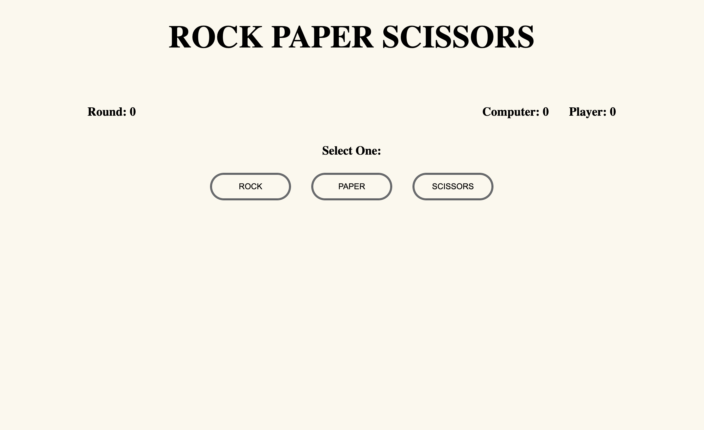

# Rock-Paper-Scissors
This project is based on the real Rock Paper Scissors game and was created for learning purposes. The game allows the user to play against a 'Computer' that generates a random decision in response to the user's input. The purpose of this project was to implement HTML, CSS, and JavaScript fundamentals.

## Websiter Preview

## Live Demo
Checkout the live version of the website <a href="https://armenta-i.github.io/rock-paper-scissors/">here</a>